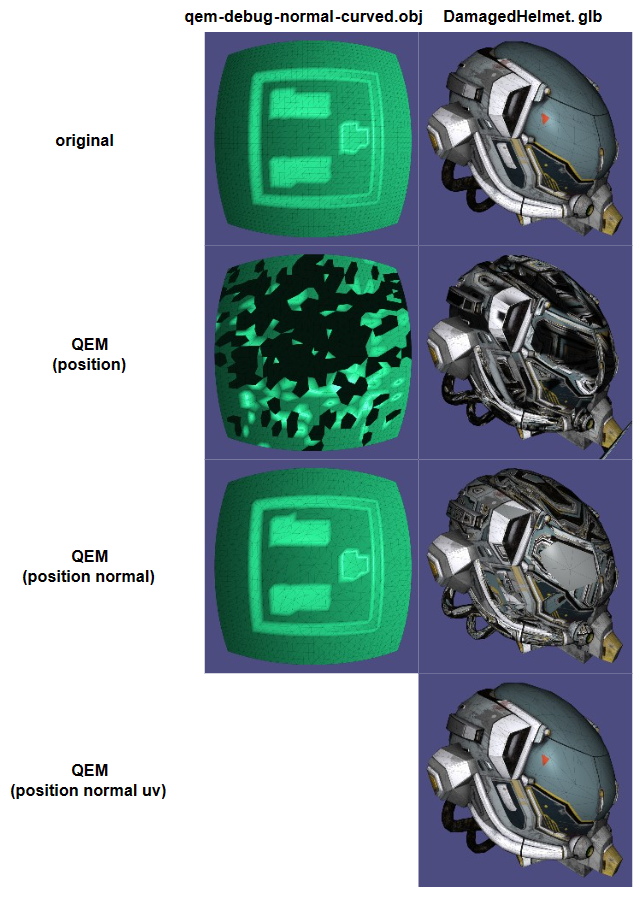

# QEM算法步骤

> 1. 计算所有顶点的quadric $Q(\pmb{A},\pmb{b},c)$
> 2. 选出所有有效pair $(\pmb{v_1}, \pmb{v_2})$，计算合并后的 $Q(\overline{\pmb{v}})$，添加到堆中
> 3. 合并 $Q$ 最小的pair $(\pmb{v_1}, \pmb{v_2})$ 至 $\overline{\pmb{v}}$
> 4. 在堆中移除所有无效的pair，将新增的pair添加到堆中；重复步骤3直至网格数量减少到目标网格数

# 实现细节

由于 DamagedHelmet.glb 中有很多共享边上的顶点是不连续的（相同的位置，不同的法线或者纹理坐标），提交的代码进行了特殊处理，采用了以下方案折叠边（***如果待简化模型 qem-debug-normal-curved.obj，您需要注释 QEMUHEMesh.h 的 556-557行***）：

> 1. 如果两个顶点同时在边界上，则不折叠；
> 2. 如果有一个顶点在边界上，则合并后的顶点数据（位置、法线和纹理坐标）将等于在边界上的那个顶点；
> 3. 如果有两个顶点都不在边界，则按照QEM算法计算新的顶点数据

# 结果

